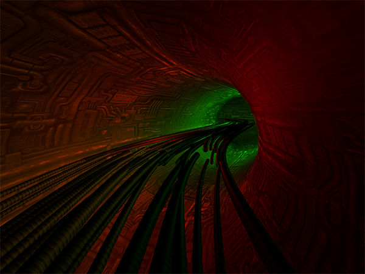

  



# ThreeJS Tunnels

  I love Tunnel Demos of old school, using tricks and visual cues to give illusions of ever falling or flying. This is my experiments and demos of various tunnel tricks and techniques.

  /src/Three.js is the import file that combines all required Three.js package files..

  ```
  import * as THREE from 'three'; // build/three.js from node_module/three
  window.THREE = THREE;
  require('three/examples/js/controls/OrbitControls.js');
  require('three/examples/js/shaders/FresnelShader');
  // ...etc for other items like Render Passes and Shaders
  ```

  Current Mapping --> ```index.js``` --> (render file) ```ShaderTunnelRender.js``` (or just about any other file in src)

## Run the example
  Requires Node v7.0.0 or greater

```bash
$ yarn install
$ yarn dev & open http://localhost:2020
```

## License

[MIT]
